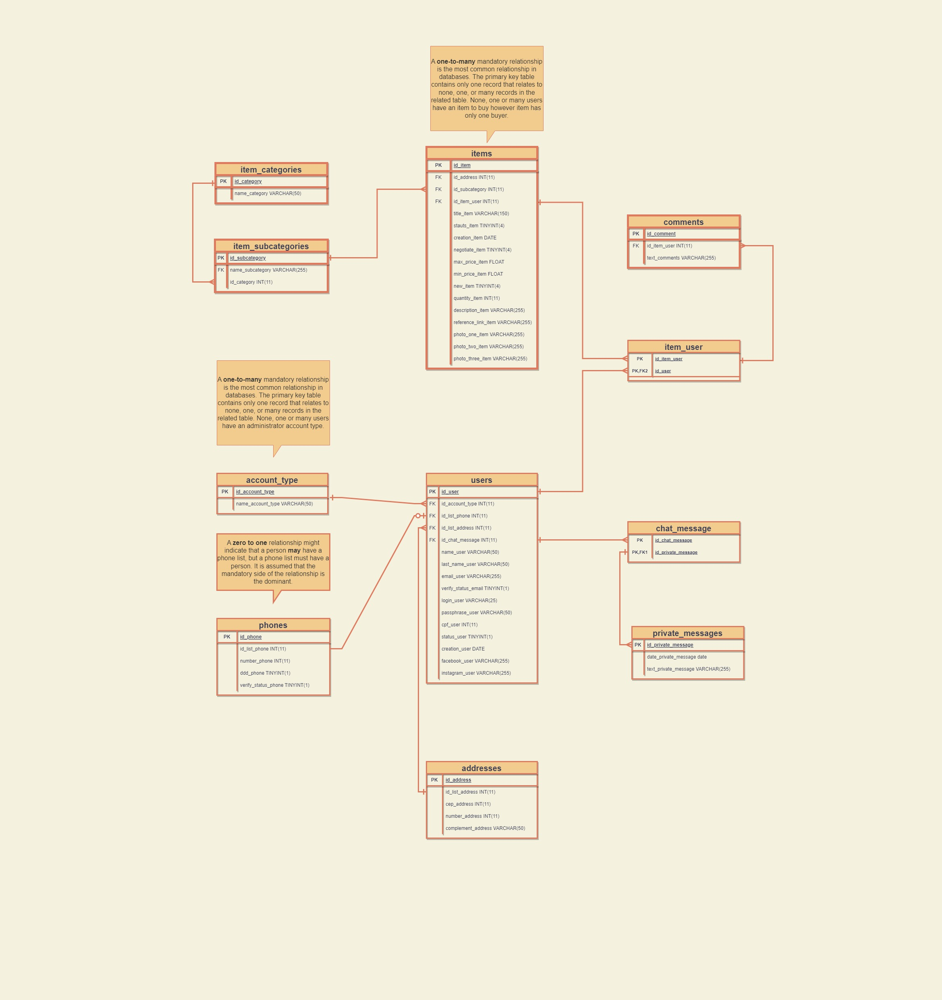

# Estrutura do Banco de dados

## Normalização 2º Forma  

comments(**id_comment**, id_list_comments, id_user, text_comment)  

items(**id_item**,  id_adress,id_subcategory, id_item_user, title_item, status_item, creation_item, negociate_item, max_price_item, min_price_item, new_item quantity_item, description_item, reference_link_item, photo_one_item, photo_two_item, photo_three_item)  

item_user(**id_item_user**, id_user)  

users(**id_user**,  id_account_type,  id_list_phone, id_list_address, id_chat_message, name_user, last_name_user, email_user, verify_status_email, login_user,  passphrase_user, cpf_user, status_user, creation_user, facebook_user, instagram_user)  

chat_message(**id_chat_message**, id_private_message)  

private_messages(**id_private_messagem**, date_private_message, text_private_message)  

item_categories(**id_category**, name_category)  

item_subcategories(**id_subcategory**, name_subcategory, id_category)  

account_types(**id_acc_type**, name_account_type)  

phones(**id_phone**, id_list_phone, number_phone, ddd_phone, verify_status_phone)  

addresses(**id_address**, id_list_address, cep_address, number_address, complement_address)  

## Referência  

[link](https://help.hitachivantara.com/Documentation/Pentaho/6.0/0N0/110/040/050#:~:text=A%20zero%20to%20many%20optional,a%20maximum%20of%20one%20person.&text=A%20zero%20to%20one%20relationship,programmer%20must%20be%20a%20person.)

<!-- rodapé -->
## Retornar README:

  [:rewind:](../../README.md)
  

