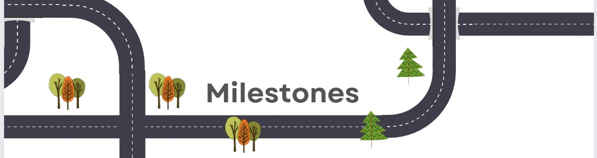

# Milestone 1 

   * [Reunião 0](#reunião-0)
   * [Reunião 1](#reunião-1)
   * [Reunião 2](#reunião-2)
   * [Reunião 3](#reunião-3)
   * [Reunião 4](#reunião-4)
      
## Reunião 0

### Presentes na reunião 0

Denize
Icaro
Jennifer
Lucas
Paula

### Pauta

 - [x]Definição do projeto
        - Ficou definido que será o "Mercado livre invertido"
 - [x]Tarefas para próxima reunião dia 27/07/2022
        - Denize - Criar repositório e iniciar o Readme.
        - Icaro e Lucas- Criar/Sugerir/Desenvolver layout para página.
        - Jennifer e Paula - Criar diagrama de entidades e relacionamento que iremos utilizar no projeto.

[Vídeo reunião](https://youtu.be/zwNY4xk1Ew4)

## Reunião 1

### Presentes na reunião 1

Denize
Icaro
Jennifer
Lucas
Paula

### Pauta

 - [x]Ver as entregas.
 - [x]Ficou definido que o nome será "Balcão Brasil"
 - [x]Tarefas para próxima reunião dia 10/07/2022.
 - [ ]Iniciar os branches com as tarefas e apresentar o que fez na semana, o que fará na seguinte e o que está impedindo.
        - Denize - Criar o banco de dados.
        - Icaro - criar login.
        - Lucas - recuperar senha.
        -Jennifer e Paula - Cadastro.

[Vídeo Reunião](https://youtu.be/gcW30uY1FTc)

## Reunião 2

### Presentes na reunião 2

Bruno
Denize
Icaro
Jennifer
Paula
Vinicius

### Pauta

 - [x]Ver andamento das tarefas
 - [ ]Discussão sobre o [Roteiro de desenvolvimento do projeto](Roteiro.md)
 - [ ]Entrega para dia 10/08/2022
 - [X]Revisão de como fazer uma branch vinculada ao issue

[Vídeo Reunião](https://youtu.be/8Q-Gt0CliZA)

## Reunião 3

### Presentes na reunião 3

Bruno
Denize
Icaro
Jennifer
Paula

### Pauta

 - [x]Ver andamento das tarefas   
 - [ ]Status das Entregas para do milestone 1-   (ATRASADO)
       -Icaro: Entrega adiada, devido a utilização do framework Laravel em vez de php tradicional.
       -Jennifer e Paula, iniciaram o cadastro porém a pedido da Denize vão fazer algumas mudanças no layout para se adequar a um cadastro incial de usuario/email/senha.
       -Bruno iniciou o projeto no figma e a entrega do HTML será adiada.
       -Denize, criado banco de dados no heroku, e identificado a necessidade de usar o PostgreSQL para usar gratuitamente no heroku, os dados estão em sintaxe de mariaDB será atualizado para proxima semana.  
 - [ ]Para proxíma sprint(17/08/2022):   
       -Icaro: entrega do layout login com laravel  
       -Jennifer e Paula: entrega do layout cadastro.  
       -Bruno: fazer o HTML da página que ele idealizou no figma  
       -Denize: Fazer deploy com laravel no site do heroku.  
- [ ]Lucas e Vinicius atualização:    
       Lucas, [8/11/2022 10:58 PM]  
                                   Sim  
       Lucas, [8/11/2022 10:58 PM]  
                                   Eu estou fazendo a parte da recuperação de senha por email   
       Lucas, [8/11/2022 10:59 PM]  
                                   Fiz em um outro site para entender como funciona  
       Lucas, [8/11/2022 10:59 PM]  
                                   Agora vou utilizar os códigos do login que serão aplicados no nosso site  

       Vinícius Nichetti, [8/12/2022 1:25 PM]  
                                   bom dia pessoal  
       Vinícius Nichetti, [8/12/2022 1:25 PM]  
                                   ainda não consegui fazer, vou precisar de mais tempo  
       Vinícius Nichetti, [8/12/2022 1:25 PM]  
                                   até encontrei um site que gera termos de uso, posso passar pra vcs depois   

[Vídeo Reunião](https://www.youtube.com/watch?v=5StYhZOrD2M)

## Reunião 4

### Presentes na reunião 4

Bruno
Denize
Icaro
Jennifer
Lucas

### Pauta

 - [x]Ver andamento das tarefas   
 - [x]Status das Entregas para do milestone 1- (ATRASADO)  
       -Icaro: Com ajuda do professor foi realizado o push com o login porém o login não segue o layout previamente feito no figma.
       -Jennifer e Paula, ainda em produção.
       -Bruno Começou o HTML mas não conseguiu concluir, está pesquisando.
       -Denize, entrega do Banco de dados no Heroku realizada juntamente com o código para criação das tabelas, tabelas estão já populando em php tradicional, só precisa integrar com o laravel.  
       -Lucas: Vai ainda realizar pesquisa e talvez um modelo/exemplo de como devemos fazer a recuperação de senha para nosso projeto
 - [ ]Para proxíma sprint(17/08/2022):  
       -Icaro, integarar o front-end que ele fez no projeto com laravel
       -Jennifer e Paula entregar a página do cadastro.
       -Realizar o deploy de uma página com banco de dados/laravel no heroku
       -Lucas Apresentar o modelo/exemplo de como recuperar senha.
       -Bruno entregar o HTML da página principal.
       -Vinicius: entregar a página do aceite de termos de uso.
[Vídeo Reunião](https://youtu.be/BalyFpXNpkU)  

<!-- rodapé -->
### Retornar README:

  [:rewind:](../../README.md)
  

