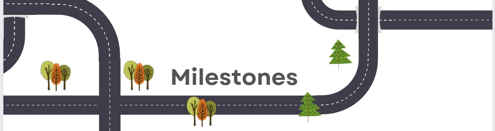

# Milestone 1 

## Presentes na reunião 0

Denize
Icaro
Jennifer
Lucas
Paula

## Pauta

 - [x]Definição do projeto
        - Ficou definido que será o "Mercado livre invertido"
 - [x]Tarefas para próxima reunião dia 27/07/2022
        - Denize - Criar repositório e iniciar o Readme.
        - Icaro e Lucas- Criar/Sugerir/Desenvolver layout para página.
        -Jennifer e Paula - Criar diagrama de entidades e relacionamento que iremos utilizar no projeto.

[Vídeo reunião](https://youtu.be/zwNY4xk1Ew4)

## Presentes na reunião 1

Denize
Icaro
Jennifer
Lucas
Paula

## Pauta

 - [x]Ver as entregas.
 - [x]Ficou definido que o nome será "Balcão Brasil"
 - [x]Tarefas para próxima reunião dia 10/07/2022.
 - [ ]Iniciar o branche com as tarefas e apresentar o que fez na semana, o que fará na seguinte e o que está impedindo.
        - Denize - Criar o banco de dados.
        - Icaro - criar login.
        - Lucas - recuperar senha.
        -Jennifer e Paula - Cadastro.

[Vídeo Reunião](https://youtu.be/gcW30uY1FTc)

<!-- rodapé -->
## Retornar README:

  [:rewind:](../../README.md)
  

