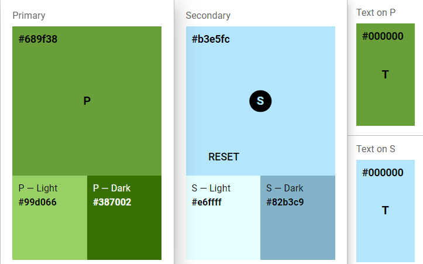

# Cores

### Cor Primária  

900: #387002
700: #689F38
500: #99d066

### Cor Secundária  

050: #82b3c9
100: #b3e5fc
200: #e6ffff

### Texto

Black: #ffffff

[CodePen Ref](https://codepen.io/debafig/pen/rNdGodG)

<!-- rodapé -->
## Retornar README:

  [:rewind:](../../README.md)

  

